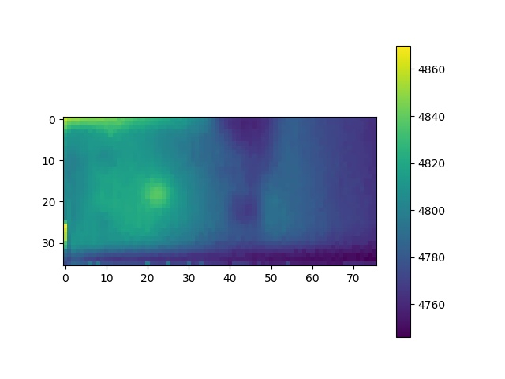
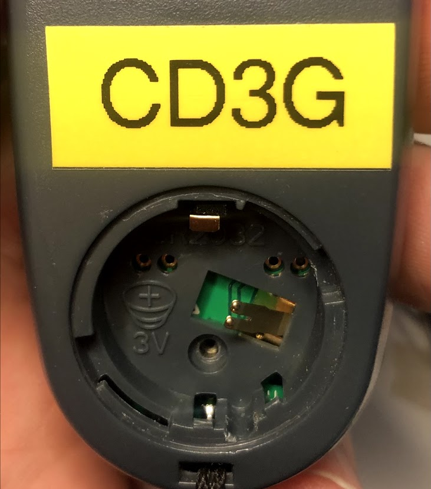
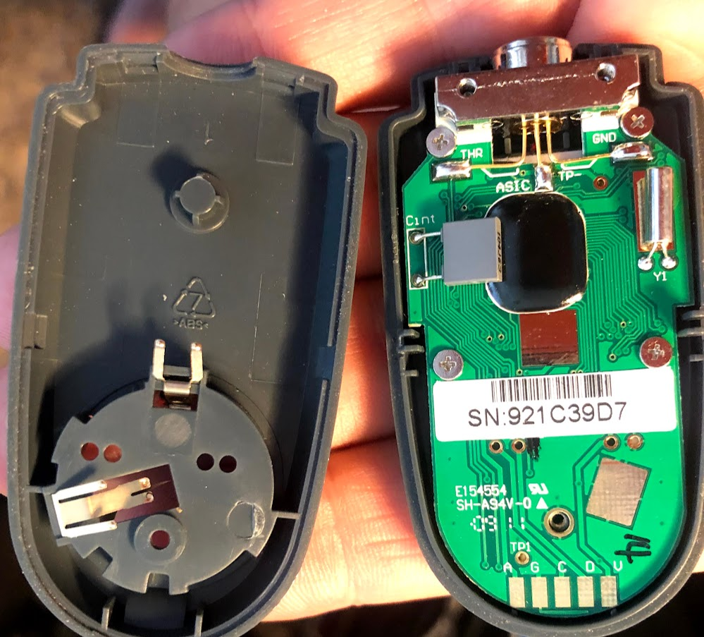
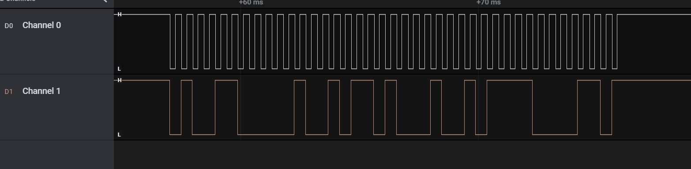
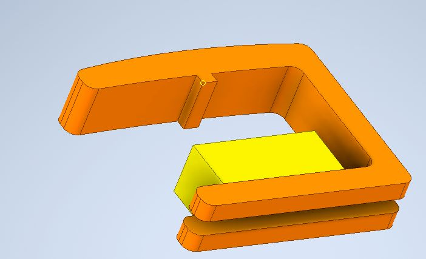
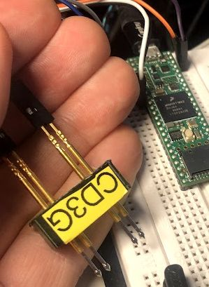
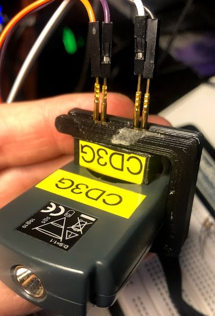
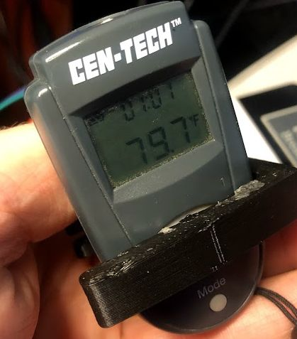

# The $11 Infrared Camera


This project aims to scan a PCB to find shorts and other thermal dissipation issues with the stuff I have lying around.

I've got a short circuit on a PCB, and wanted to find out where it is.  Yes, I should have a thermal camera, but I don't.  So, I started probing it with this [$11 infrared sensor](https://www.harborfreight.com/non-contact-pocket-thermometer-93983.html) from Harbor Freight.   That helped me figure out where the short is, but I figured it'd be nifty to use my 3D printer to scan along the PCB and take a thermal 'picture' pixel by pixel of the PCB. 

I opened up the back of the sensor, and what do you know... under the battery are 4 test points under the battery.  



And opening the back of the case up reveals that those test points are...  Clock, Data, 3V and GND, in that order.


I applied 3 volts, and voila!  We get data!



There are 4 pins:  Clock, Data, 3V and GND.  Pretty self-explanatory.  To make things easier, I built up a little pogo pin holder to easily interface with the device.    This pogo holder serves two purposes, to hold the pogo pins in place, and do depress the 'measure' button continuously.






The design files for this holder are in the [3d-files](3d-files) directory.

## Data format
After searching online for what seemed like forever, but was probably about 30 seconds, I couldn't find any documentation of the data format.  

### Arduino code
In order to capture the data more easily, I built up a little arduino sketch that will sniff the data (with a lousy but functional software shift-register) and print it out.

The arduino software is in the [arduino-code](arduino-code) directory.  Load this up on 3.3V arduino, whatever kind should work fine, as long as it's 3.3Volts, and you should start getting data spit out to the COM port console that looks like this:

```
0x0000004c1322810d
0x0000004c1321800d
0x0000004c13207f0d
0x000000530000530d
0x0000004c13207f0d
0x000000530000530d
0x0000006612c9410d
0x0000004c1321800d
0x0000004c13207f0d
0x0000004c131f7e0d
0x000000530000530d
0x0000006612c9410d
0x0000004c131f7e0d
```

### Python code to read and parse the arduino output
There is a python library for connecting to the arduino in the [python](python) directory.

After a few hours of plotting bits and scratching my head, It turns the data format is 40-bits.  When bits `[39:32] == 0x4c`, that's a data frame with temperature.  In that data frame, bits `[31:16]` are the temperature.  

Here's a temperature plot of some captured data as i pointed the sensor at a piece of old PCB and heated it up with a hot air gun.  Then took the PCB away, and put it back for a while.


The x-axis is seconds, the Y axis is 'temperature'.  Units TBD.

## Capture program
This data was captured from the arduino COM port with the temperature-plot.py program, which does a live-updating plot of the temperature returned from the arduino.

# Bring on the 3d printer!
Now, what remains to be solved, is scanning the sensor across the 3d printer...
